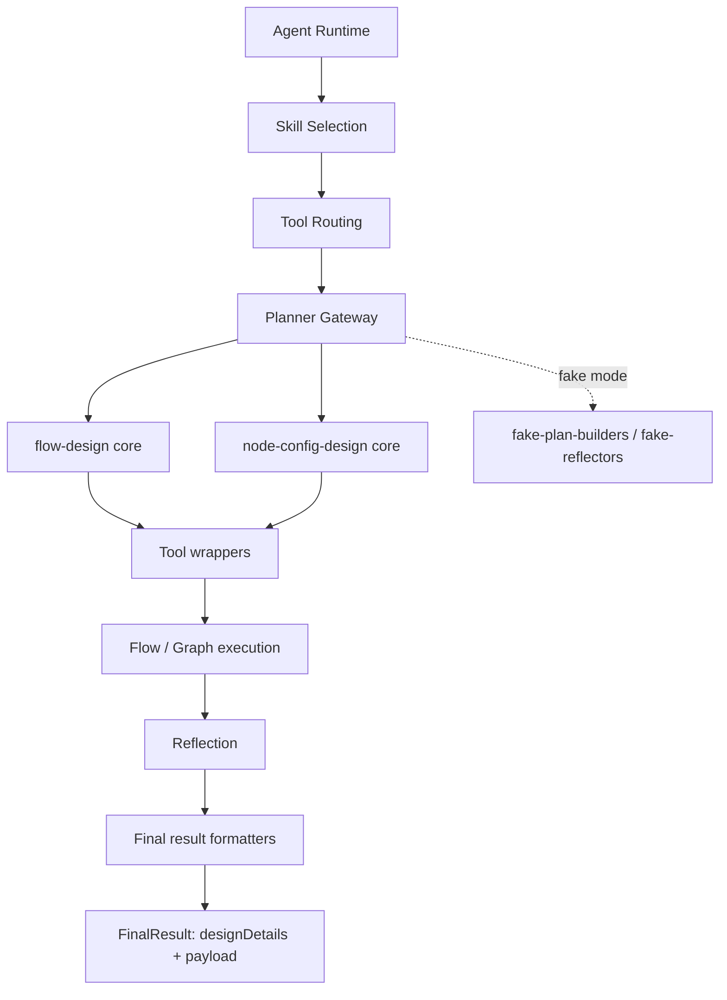

# TypeScript LLM Agent Runtime

Production-style TypeScript agent runtime demonstrating skill selection, tool routing, planning/execution/reflection, approvals, resilience, persistence abstraction, and observability.

## Project Purpose

This project is a practical baseline for building an LLM agent runtime that can run in three modes:

- deterministic fake gateway for tests and local demos
- real OpenAI gateway for API-backed behavior via the official OpenAI Node SDK
- real Gemini gateway for API-backed behavior via the official Google GenAI SDK

## Architecture Overview

Core flow:

1. `SkillSelector` chooses one skill from user input.
2. Skill instructions are loaded from `SKILL.md`.
3. `MultiSkillRouter` limits visible tools to those allowed by the chosen skill.
4. `Planner` creates structured steps (`parallel-tools`, `single-tool`, `reasoning`, `finalize`) validated by zod.
5. `StepExecutor` executes each step with policy and resilience controls.
6. If a tool requires confirmation, runtime suspends with `waiting_for_approval`.
7. `resume()` continues after `approve`, `reject`, or `edit-and-approve`.
8. `Reflector` checks completion and `Finalizer` returns structured output.
9. `AgentTracer` captures structured run events.

Layered structure:

1. `src/agent/*`
   Shared runtime contracts, execution flow, persistence hooks, and final-result assembly helpers.
2. `src/flow-design/*`
   Core flow-design logic: intent analysis, task-graph reasoning, draft composition, sample execution, reflection, DTOs, provider boundary, and deterministic mocks.
3. `src/node-config-design/*`
   Core node-configuration logic: block-family strategies, knowledge sources, validation, and DTOs.
4. `src/tools/*`
   Thin runtime-facing tool wrappers that delegate into the shared design cores.
5. `src/flow-agent/*`, `src/node-config-agent/*`
   Compatibility/wrapper agents that compose the cores for skill-oriented usage.
6. `src/llm/fake-*.ts`
   Deterministic fake planning, reflection, and final formatting helpers used by tests and demos.

Architecture sketch:



Design boundary summary:

- `designDetails` in `FinalResult` is the shared DTO-oriented summary for UI and persistence.
- `payload` in `FinalResult` is the skill-specific structured result.
- `FakeLlmGateway` is intentionally thin and delegates planning, reflection, and formatting to helper modules.
- Example/demo strings are kept in deterministic mock modules where practical so core orchestration code stays focused on design flow rather than fixtures.

## Recommended Imports

Use the root barrel for most application code:

```ts
import {
    AgentRuntime,
    FakeLlmGateway,
    FlowDesignProduct,
    buildDefaultToolRegistry,
    InMemoryRunStateStore,
    createRuntime,
} from '/Users/dujung/Documents/Codex/src';
```

Use layer-specific barrels when you want tighter boundaries:

```ts
import { buildFlowDesignerPayload } from '/Users/dujung/Documents/Codex/src/agent';
import { buildFlowDesignerPlan } from '/Users/dujung/Documents/Codex/src/llm';
import { designFlowDraft } from '/Users/dujung/Documents/Codex/src/flow-design';
import { NodeConfigDesignService } from '/Users/dujung/Documents/Codex/src/node-config-design';
import { UnifiedRunEventBus } from '/Users/dujung/Documents/Codex/src/observability';
```

That split mirrors the current architecture:

- root barrel: convenient app-facing API
- layer barrels: clearer internal boundaries and lower accidental coupling

Product-facing usage:

```ts
import { FlowDesignProduct } from '/Users/dujung/Documents/Codex/src';

const product = new FlowDesignProduct();

const preflight = await product.preflight('이메일을 확인해서 답장 해줘');
const design = await product.design('키워드를 줄테니 블로그 타이틀 여러개 만들기');
```

Use `FlowDesignProduct` when the application wants explicit product operations such as:

- preflight validation
- full flow design
- node-configuration design

Use `AgentRuntime` directly when the application wants lower-level skill/runtime control.

## File Structure

```text
.
├─ package.json
├─ tsconfig.json
├─ vitest.config.ts
├─ .env.example
├─ README.md
├─ src/
│  ├─ index.ts
│  ├─ demo.ts
│  ├─ agent/
│  ├─ flow-design/
│  ├─ node-config-design/
│  ├─ flow-agent/
│  ├─ node-config-agent/
│  ├─ llm/
│  ├─ tools/
│  ├─ policy/
│  ├─ resilience/
│  ├─ state/
│  └─ observability/
├─ data/
│  └─ skills/
└─ tests/
```

## Install

```bash
nvm use
npm install
```

## Run Tests

```bash
npm test
```

## Run Demo

```bash
npm run demo
```

All npm scripts are wrapped through [`scripts/with-project-node.sh`](/Users/dujung/Documents/Codex/scripts/with-project-node.sh), which sources `nvm` and uses the version from [.nvmrc](/Users/dujung/Documents/Codex/.nvmrc).
The project targets Node.js `22.15.1` or newer and is intended to remain compatible with later major versions.

Demo shows:

- normal completed run
- run suspended for approval
- resumed run after approval

## Fake vs Real Gateways

Default is fake gateway.

To use OpenAI:

1. copy `.env.example` to `.env`
2. set `OPENAI_API_KEY`
3. optionally set `OPENAI_MODEL`
4. set `USE_REAL_OPENAI=true`
5. optionally set `OPENAI_STRUCTURED_PROXY_URL` to route structured parsing through an external HTTP proxy

Runtime selects gateway in [`src/index.ts`](./src/index.ts).
The OpenAI gateway is implemented against the SDK `responses.parse` structured-output flow and expects `openai@^6.27.0`.
When `OPENAI_STRUCTURED_PROXY_URL` is set, the gateway serializes the active schema and delegates the structured parse call over HTTP.

To use Gemini:

1. copy `.env.example` to `.env`
2. set `GEMINI_API_KEY` or `GOOGLE_API_KEY`
3. optionally set `GEMINI_MODEL`
4. set `LLM_PROVIDER=gemini` or `USE_REAL_GEMINI=true`

The Gemini gateway is implemented against `@google/genai@^1.28.0` and uses `responseMimeType=application/json` with `responseJsonSchema`.
The Gemini SDK requires Node.js 20 or newer for real API execution, and this project standardizes on Node.js 22+.

## Environment Variables

- `OPENAI_API_KEY`: API key for real gateway
- `OPENAI_MODEL`: model name (default: `gpt-4.1-mini`)
- `OPENAI_STRUCTURED_PROXY_URL`: optional HTTP endpoint for proxied structured parsing
- `GEMINI_API_KEY`: API key for Gemini API
- `GOOGLE_API_KEY`: alternative Gemini API key env var
- `GEMINI_MODEL`: model name (default: `gemini-2.0-flash`)
- `LLM_PROVIDER`: `fake`, `openai`, or `gemini`
- `USE_REAL_GEMINI`: `true` or `false`
- `USE_REAL_OPENAI`: `true` or `false`
- `CODEX_RESOURCE_ROOT`: optional shared resource root; defaults to `/Users/dujung/Documents/Codex/data`
- `CODEX_RESOURCE_PROFILE`: optional resource profile suffix; if set to `staging`, the loader will prefer files such as `FLOW_DESIGN_DEFAULTS.staging.json` when they exist inside the resource root

Resource loading notes:

- JSON-backed defaults, skill knowledge, and deterministic fake copy are loaded through a shared cached resource layer.
- Today the default source is the local filesystem.
- The resource boundary is intentionally abstracted so the same modules can later be backed by a remote config service, database, or managed manifest store without rewriting the design cores.
- The runtime now expects one shared resource root rather than per-file override paths.

Expected resource root structure:

```text
<CODEX_RESOURCE_ROOT>/
├─ runtime/
│  └─ FAKE_LLM_COPY.json
└─ skills/
   ├─ flow-designer/
   │  ├─ FLOW_DESIGN_DEFAULTS.json
   │  └─ FLOW_DESIGN_KNOWLEDGE.json
   └─ node-config-designer/
      ├─ NODE_CONFIG_DEFAULTS.json
      └─ NODE_CONFIG_KNOWLEDGE.json
```

Profile-specific variants follow the same layout by inserting the profile name before the extension. Examples:

- `skills/flow-designer/FLOW_DESIGN_DEFAULTS.staging.json`
- `skills/node-config-designer/NODE_CONFIG_KNOWLEDGE.production.json`
- `runtime/FAKE_LLM_COPY.dev.json`

## Future Extensions

- Add Postgres implementation of `RunStateStore`
- Expose runtime through an HTTP API
- Attach a web UI for approvals and trace inspection
- Add distributed tracing / metrics sink
- Expand skill packs and external tool adapters

See [docs/ROADMAP.md](/Users/dujung/Documents/Codex/docs/ROADMAP.md) for the current TODOs grouped by layer.
