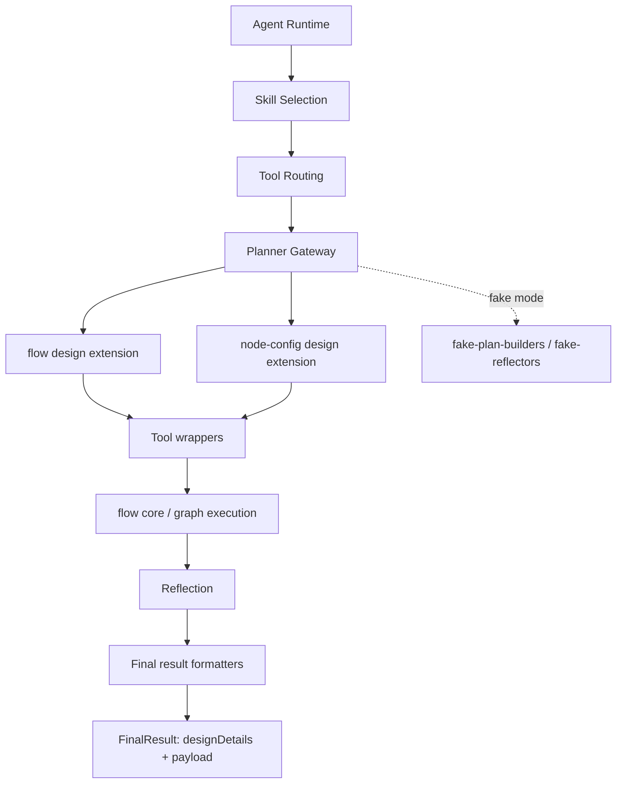

# TypeScript LLM Agent Runtime

Production-style TypeScript agent runtime demonstrating skill selection, tool routing, planning/execution/reflection, approvals, resilience, persistence abstraction, and observability.

## Project Purpose

This project is a practical baseline for building an LLM agent runtime that can run in three modes:

- deterministic fake gateway for tests and local demos
- real OpenAI gateway for API-backed behavior via the official OpenAI Node SDK
- real Gemini gateway for API-backed behavior via the official Google GenAI SDK

## Architecture Overview

Core flow:

1. `SkillSelector` chooses one skill from user input.
2. Skill instructions are loaded from `SKILL.md`.
3. `MultiSkillRouter` limits visible tools to those allowed by the chosen skill.
4. `Planner` creates structured steps (`parallel-tools`, `single-tool`, `reasoning`, `finalize`) validated by zod.
5. `StepExecutor` executes each step with policy and resilience controls.
6. If a tool requires confirmation, runtime suspends with `waiting_for_approval`.
7. `resume()` continues after `approve`, `reject`, or `edit-and-approve`.
8. `Reflector` checks completion and `Finalizer` returns structured output.
9. `AgentTracer` captures structured run events.

Layered structure:

1. `src/agent/*`
   Shared runtime contracts, execution flow, persistence hooks, and final-result assembly helpers.
2. `src/flow/*`
   Shared flow core: block pool, block matching, document model, runtime execution, graph conversion, serialization, and live design monitoring.
3. `src/flow/design/*`
   Flow-design extension layer: intent analysis, task-graph reasoning, draft composition, sample execution, reflection, DTOs, provider boundary, deterministic mocks, and a manifest-backed resource surface.
4. `src/flow/node-config/design/*`
   Node-configuration design core: block-family strategies, validation, DTOs, and a manifest-backed defaults/knowledge surface plus metadata-backed strategy guidance.
5. `src/prompt-lab/*`
   Interactive prompt-improvement workflow: real LLM-backed execution, artifact capture, self-review, user feedback collection, and final Codex prompt synthesis.
6. `src/tools/*`
   Shared tool infrastructure only: registry, repository, type contracts, and resource-backed pack loading.
7. `src/flow/agent/*`, `src/flow/node-config/agent/*`
   Skill-oriented flow wrappers plus the flow-owned runtime tool implementations.
8. `src/agent/sample-tools.ts`
   Sample/demo tool pack implementation kept outside `tools/core` so shared tool infrastructure stays small.
9. `src/llm/fake-*.ts`
   Deterministic fake planning, reflection, and final formatting helpers used by tests and demos.

Architecture sketch:



Design boundary summary:

- `designDetails` in `FinalResult` is the shared DTO-oriented summary for UI and persistence.
- `payload` in `FinalResult` is the skill-specific structured result.
- `FakeLlmGateway` is intentionally thin and delegates planning, reflection, and formatting to helper modules.
- Example/demo strings are kept in deterministic mock modules where practical so core orchestration code stays focused on design flow rather than fixtures.

## Recommended Imports

Use the root barrel for most application code:

```ts
import {
    AgentRuntime,
    FakeLlmGateway,
    FlowDesignProduct,
    buildDefaultToolRegistry,
    InMemoryRunStateStore,
    createRuntime,
} from './src';
```

Use layer-specific barrels when you want tighter boundaries:

```ts
import { buildFlowDesignerPayload } from './src/agent';
import { buildFlowDesignerPlan } from './src/llm';
import { designFlowDraft } from './src/flow/design';
import { NodeConfigDesignService } from './src/flow/node-config/design';
import { UnifiedRunEventBus } from './src/observability';
import { PromptLabProduct } from './src/prompt-lab';
```

That split mirrors the current architecture:

- root barrel: convenient app-facing API
- layer barrels: clearer internal boundaries and lower accidental coupling
- `src/flow/*`: shared flow surface that now re-exports its nested design, agent, and node-config extensions

Product-facing usage:

```ts
import { FlowDesignProduct } from './src';

const product = new FlowDesignProduct();

const preflight = await product.preflight('이메일을 확인해서 답장 해줘');
const design = await product.design('키워드를 줄테니 블로그 타이틀 여러개 만들기');
```

Use `FlowDesignProduct` when the application wants explicit product operations such as:

- preflight validation
- full flow design
- node-configuration design

Use `AgentRuntime` directly when the application wants lower-level skill/runtime control.

Runtime factory usage:

```ts
import { createRuntime } from './src';

const runtime = await createRuntime();
```

## File Structure

```text
.
├─ package.json
├─ tsconfig.json
├─ vitest.config.ts
├─ .env.example
├─ README.md
├─ src/
│  ├─ index.ts
│  ├─ demo.ts
│  ├─ agent/
│  ├─ flow/
│  │  ├─ design/
│  │  ├─ agent/
│  │  └─ node-config/
│  │     ├─ design/
│  │     └─ agent/
│  ├─ llm/
│  ├─ prompt-lab/
│  ├─ tools/
│  ├─ policy/
│  ├─ resilience/
│  ├─ state/
│  └─ observability/
├─ data/
│  ├─ flow/
│  ├─ products/
│  ├─ runtime/
│  ├─ skills/
│  └─ tools/
└─ tests/
```

## Install

```bash
nvm use
npm install
```

## Run Tests

```bash
npm test
```

## Run Demo

```bash
npm run demo
```

## Run Prompt Lab

```bash
npm run prompt-lab
```

`prompt-lab` starts an interactive CLI that:

- chooses provider plus `main` and `lite` models
- chooses which flow skill to validate (`flow-preflight-validator`, `flow-designer`, or `node-config-designer`)
- follows Korean by default, with English selectable
- runs the real agent flow and records artifacts under `output/labs/`
- generates a self-review
- accepts operator feedback
- synthesizes a final Codex prompt for the next iteration

All npm scripts are wrapped through [`scripts/with-project-node.sh`](./scripts/with-project-node.sh), which sources `nvm` and uses the version from [`.nvmrc`](./.nvmrc).
The project targets Node.js `22.15.1` or newer and is intended to remain compatible with later major versions.

Demo shows:

- normal completed run
- run suspended for approval
- resumed run after approval

## Fake vs Real Gateways

Default is fake gateway.

To use OpenAI:

1. copy `.env.example` to `.env`
2. set `OPENAI_API_KEY`
3. optionally set `OPENAI_MODEL`
4. set `USE_REAL_OPENAI=true`
5. optionally set `OPENAI_STRUCTURED_PROXY_URL` to route structured parsing through an external HTTP proxy

Runtime selects gateway in [`src/index.ts`](./src/index.ts).
The OpenAI gateway is implemented against the SDK `responses.parse` structured-output flow and expects `openai@^6.27.0`.
When `OPENAI_STRUCTURED_PROXY_URL` is set, the gateway serializes the active schema and delegates the structured parse call over HTTP.

To use Gemini:

1. copy `.env.example` to `.env`
2. set `GEMINI_API_KEY` or `GOOGLE_API_KEY`
3. optionally set `GEMINI_MODEL`
4. set `LLM_PROVIDER=gemini` or `USE_REAL_GEMINI=true`

The Gemini gateway is implemented against `@google/genai@^1.28.0` and uses `responseMimeType=application/json` with `responseJsonSchema`.
The Gemini SDK requires Node.js 20 or newer for real API execution, and this project standardizes on Node.js 22+.

## Environment Variables

- `OPENAI_API_KEY`: API key for real gateway
- `OPENAI_MODEL`: model name (default: `gpt-4.1-mini`)
- `OPENAI_LITE_MODEL`: lite model name for lower-cost structured tasks and prompt synthesis
- `OPENAI_STRUCTURED_PROXY_URL`: optional HTTP endpoint for proxied structured parsing
- `GEMINI_API_KEY`: API key for Gemini API
- `GOOGLE_API_KEY`: alternative Gemini API key env var
- `GEMINI_MODEL`: model name (default: `gemini-2.0-flash`)
- `GEMINI_LITE_MODEL`: lite model name for lower-cost structured tasks and prompt synthesis
- `LLM_PROVIDER`: `fake`, `openai`, or `gemini`
- `USE_REAL_GEMINI`: `true` or `false`
- `USE_REAL_OPENAI`: `true` or `false`
- `CODEX_RESOURCE_ROOT`: optional shared resource root; defaults to `./data`
- `CODEX_RESOURCE_PROFILE`: optional resource profile suffix; if set to `staging`, the loader will prefer files such as `FLOW_DESIGN_MANIFEST.staging.yml` when they exist inside the resource root
- `CODEX_DEBUG_LOGS=1`: enables additional diagnostic logs for resource loading, task-type/task-graph selection, and key node-config decisions. Warnings and errors are still logged without this flag.

Resource loading notes:

- YAML-backed manifests are loaded through a shared async resource layer.
- Today the default source is the local filesystem.
- The resource boundary is intentionally abstracted so the same modules can later be backed by a remote config service, database, or managed manifest store without rewriting the design cores.
- The runtime now expects one shared resource root rather than per-file override paths.
- Each major resource consumer reads through an id-based resource registry and manifest surface:
  - `flow/design`: `getFlowDesignManifest()`
  - `flow/node-config/design`: `getNodeConfigDesignManifest()`
  - `llm/runtime`: `getLlmRuntimeManifest()`
- `tools`: shared tool infrastructure that registers resource-backed tool packs through `buildDefaultToolRegistry()`

Expected resource root structure:

```text
<CODEX_RESOURCE_ROOT>/
├─ flow/
│  ├─ BLOCK_POOL.yml
│  └─ RESOURCE.md
├─ products/
│  └─ prompt-lab/
│     ├─ PROMPT_LAB_MANIFEST.yml
│     └─ RESOURCE.md
├─ runtime/
│  └─ LLM_RUNTIME_MANIFEST.yml
├─ skills/
│  ├─ RESOURCE.md
│  ├─ flow-designer/
│  │  ├─ SKILL.md
│  │  ├─ FLOW_DESIGN_MANIFEST.yml
│  │  ├─ TOOLS.yml
│  │  └─ RESOURCE.md
│  ├─ flow-preflight-validator/
│  │  ├─ SKILL.md
│  │  ├─ TOOLS.yml
│  │  └─ RESOURCE.md
│  └─ node-config-designer/
│     ├─ SKILL.md
│     ├─ NODE_CONFIG_MANIFEST.yml
│     ├─ TOOLS.yml
│     └─ RESOURCE.md
└─ tools/
   └─ sample-tools/
      └─ TOOLS.yml
```

Agent-owned tool sets now live alongside each agent's skill/manifest resources. Sample/demo packs that are reused across tests or local flows, such as `sample-tools`, remain in the top-level `tools/` area until a real shared/common resource surface is introduced.

Each resource-owning folder may also include a small `RESOURCE.md` file that explains:

- which files in that folder are owned by the skill or shared pack
- which tuning changes belong there
- which changes should stay in shared runtime/common areas

Shared flow resources now live under `data/flow/`. See [`data/flow/RESOURCE.md`](./data/flow/RESOURCE.md) for the block-pool ownership and matching-policy editing guidance.
Skill-owned extension resources live under `data/skills/`. See [`data/skills/RESOURCE.md`](./data/skills/RESOURCE.md) for the shared-vs-skill-owned split.

The code hierarchy mirrors that split:

- `src/flow/*`: shared flow core
- `src/flow/design/*`: flow-design extension
- `src/flow/node-config/design/*`: node-config extension
- `src/flow/agent/*` and `src/flow/node-config/agent/*`: skill-oriented wrappers and flow-owned tool implementations on top of those cores
- `src/tools/core/*`: reusable tool infrastructure only
- `src/agent/sample-tools.ts`: sample/demo tool pack implementation

Each tool set manifest also carries a `version` field so pack-level migration can be introduced later without changing the runtime loading contract.
Tool sets also carry:

- `owner`: the skill or area that owns the pack
- `scope`: one of `agent-owned`, `sample-only`, or `shared`

Profile-specific variants follow the same layout by inserting the profile name before the extension. Examples:

- `skills/flow-designer/FLOW_DESIGN_MANIFEST.staging.yml`
- `skills/flow-designer/TOOLS.staging.yml`
- `skills/flow-preflight-validator/TOOLS.staging.yml`
- `skills/node-config-designer/NODE_CONFIG_MANIFEST.production.yml`
- `skills/node-config-designer/TOOLS.production.yml`
- `runtime/LLM_RUNTIME_MANIFEST.dev.yml`
- `tools/sample-tools/TOOLS.dev.yml`

## Future Extensions

- Add Postgres implementation of `RunStateStore`
- Expose runtime through an HTTP API
- Attach a web UI for approvals and trace inspection
- Add distributed tracing / metrics sink
- Expand skill packs and external tool adapters

See [`docs/ROADMAP.md`](./docs/ROADMAP.md) for the current TODOs grouped by layer.
